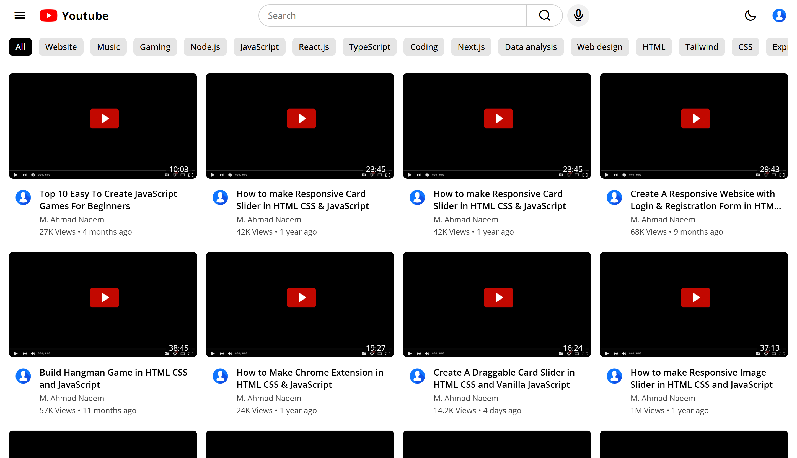

# 🎬 YouTube HomePage Clone


A beautiful and sleek clone of the YouTube homepage built with pure HTML, CSS, and JavaScript. This project aims to replicate the look and feel of YouTube's main page, focusing on responsive design and modern UI/UX practices.

---

## ✨ Features

- Responsive layout for desktop and mobile
- Interactive navigation bar
- Video thumbnails with hover effects
- Sidebar with categories
- Search bar UI
- Clean and modern design

---

## 🚀 Demo



> _Tip: Add your own screenshot in the `images/` folder as `screenshot.png` for best results._

---

## 🛠️ Technologies Used

- HTML5
- CSS3 (Flexbox & Grid)
- JavaScript (Vanilla)

---

## 🖥️ Getting Started

1. **Clone the repository:**
   ```bash
   git clone https://github.com/your-username/youtube-homepage-clone.git
   ```
2. **Navigate to the project folder:**
   ```bash
   cd youtube-homepage-clone
   ```
3. **Open `index.html` in your browser.**

---

## 📁 Project Structure

```
index.html
style.css
script.js
images/
```

---

## 🙏 Credits

- YouTube logo and icons are trademarks of Google LLC and are used here for educational purposes only.
- UI inspired by [YouTube](https://youtube.com).

---

## 📄 License

This project is for educational and personal use only. Not for commercial use.

---

## 🤝 Connect with Me

If you enjoyed this project, follow and connect with me on [LinkedIn](https://www.linkedin.com/in/muhammad-ahmad-naeem-1774953bb/) for more updates and projects!
